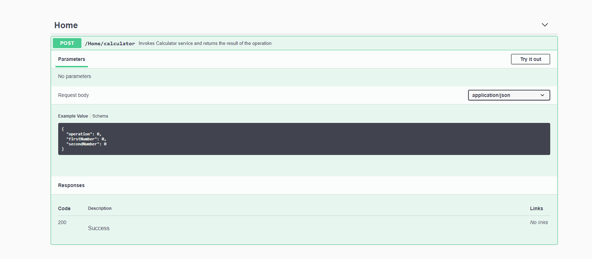
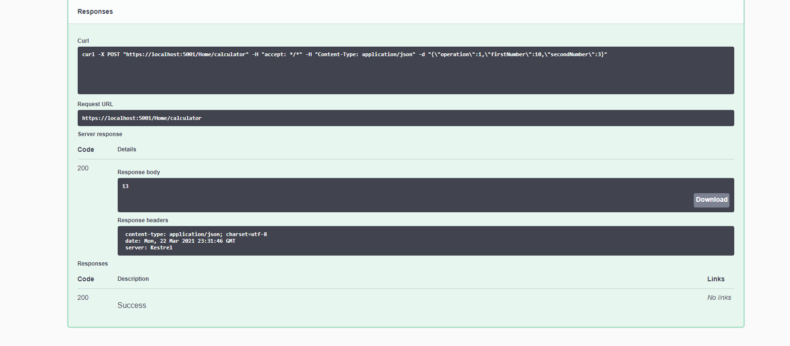
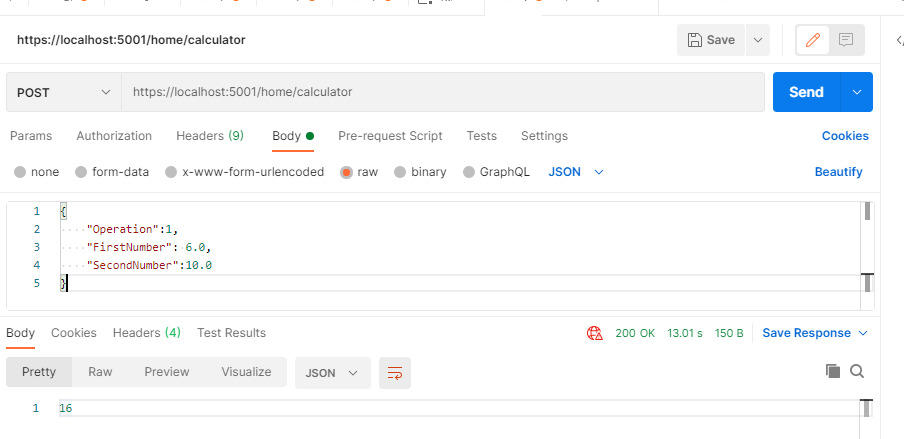
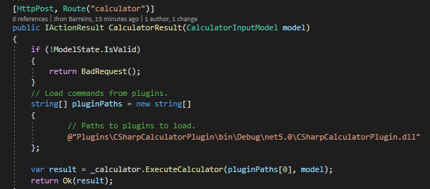

# MOP Calculator Test

## About
The aim fo this excercise is to build a Plug-in Oriented Architecture application to allow basic Calculator functionality to be easily swapped without affecting the consuyming Client application. 


## Version history
The current Calculator API version is v.1 (Dev)

## Key features

The Calculator App allows for developers to test basic Calculator funcionality and to swap calculators. All that needs to be done is create a new plugin, register it with the API and run the application.

## Typical responses

When performing a calculation, a typical response will contain the result of the operation. In the case of a Console application, the calculator returns a Double data type. In the case of a Web request, the application returns a 200 success response along with the result of the calculation.


## Architecture

The architecture closely follows a Plug-in architecture. The main components of the whole app are:


## Testing the MOP Calculator API

Simply run the MOP.Calculator.API from Visual Studio. A browser will open and the following UI will be displayed:


Follow the steps as indicated in the Front end. Calculation results are displayed as Web responses:


## Postman support
From Postman, use the following criteria:
```
http://{baseUrl}/home/calculator/
```
Set headers as follows:
```
HEADERS => Content-Type: application/json
```
Lastly, pass the following JSon content (raw body):
```
{
    "Operation":1,
    "FirstNumber": 6.0,
    "SecondNumber":10.0
}
```
The image below demonstrates a postman test



## Libraries

In addition to the standard Microsoft Net 5.0 libraries, The MOP Calculator API uses the following libraries which are core to the architecture and functionality

* Swashbuckle.AspNetCore 5.6.3
* NLog 4.7.8
* MediatR.Extensions.Microsoft.DependencyInjection at Service layer

# Known issues

In the Home Controller (see image below), the path to find available plugins is hardcoded. The aim is to read it from a configuration file rather than having it hardcoded.
There is an entry in the appsettings.json and a Configuration class ready to be used to overcome this scenario.


The same happens in the CalculatorService class, where the name of the Plugin to be loaded is hardcoded (see image below). Again, this should be obtained from a configuration file or pulled from a plugin store (db, etc)


For issues please contact the [Developer](jhon.barreiro@gmail.com).
